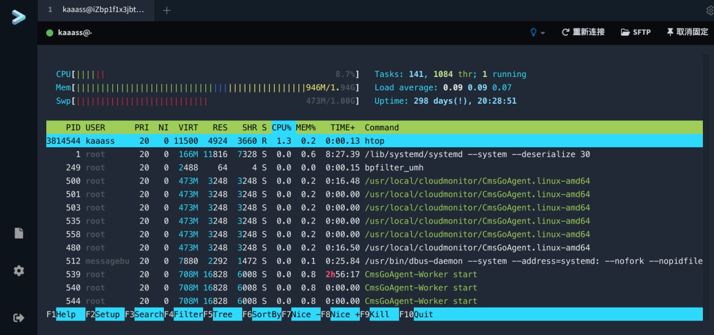

# docker-tabby-web-in-n-clicks

Docker Compose 好几键部署 Tabby Web 套装

## 端口

- 9090/tcp：Web 端
- 9000/tcp：SSH Gateway

## 前置要求

1. 在 Github 添加 OAuth APP，回调地址：http://localhost:9090/api/1/auth/social/
2. 修改 `.env` 的内容

## 使用

1. `docker-compose up -d`
2. 下载 tabby-web-container：`docker-compose run tabby /manage.sh add_version [版本]`。[版本列表](https://www.npmjs.com/package/tabby-web-container?activeTab=versions)。
3. `mv ./data/app-dist/tmp*/* ./data/app-dist && rm -r ./data/app-dist/tmp*` 

如果要使用自己的 Gateway，登陆后在设置里填写 Gateway 地址（如 `ws://localhost:9000`）与 Token。

## See also

- https://github.com/Eugeny/tabby-web
- https://github.com/Eugeny/tabby-connection-gateway
